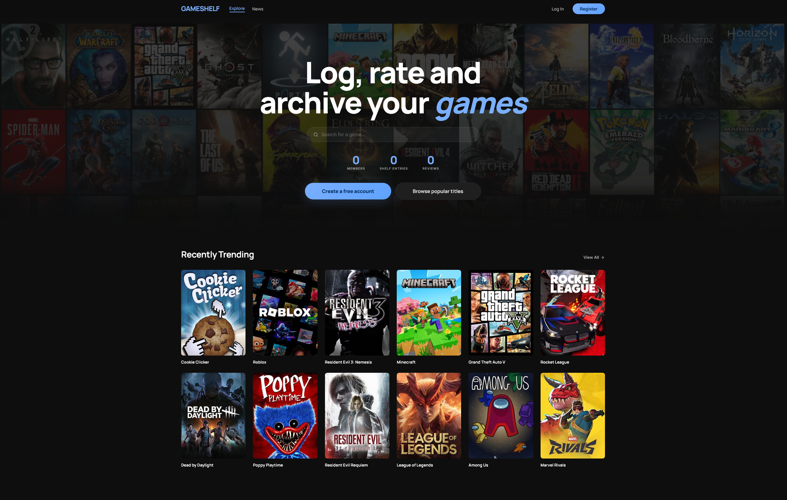
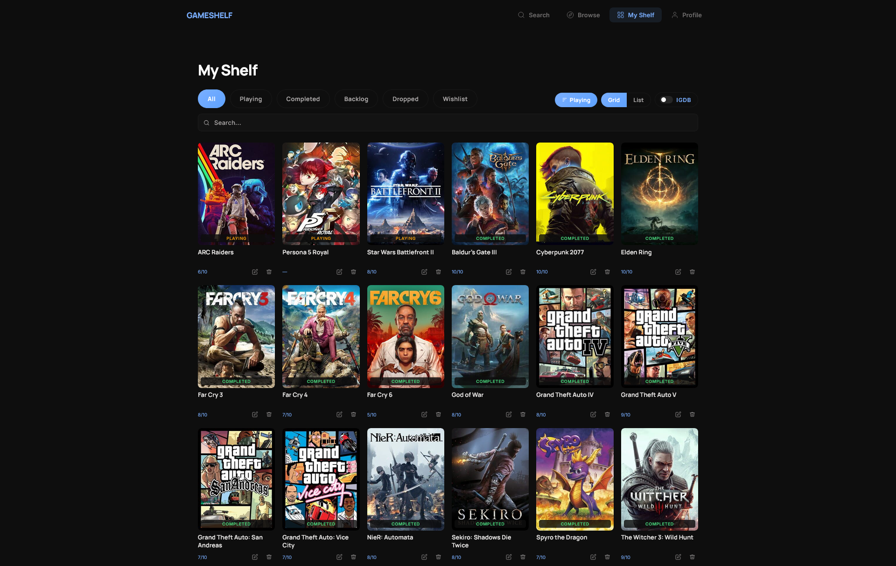
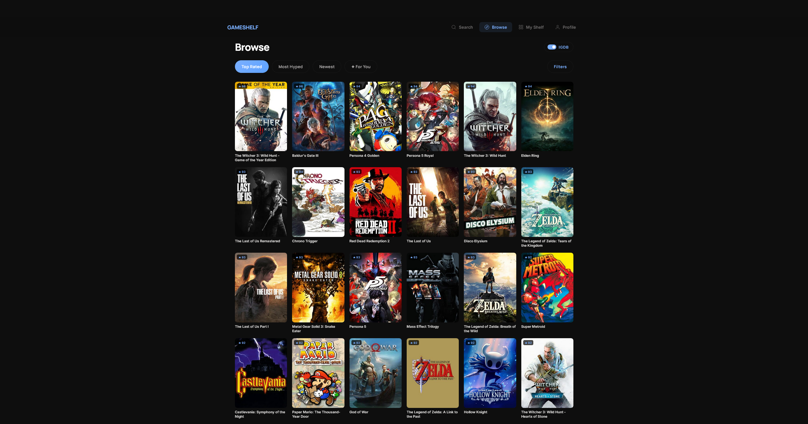

# 🎮 GameShelf

> Log, rate, and archive your games.

GameShelf is a full-stack game collection tracker and discovery platform. Search the IGDB catalog, log games to your shelf, rate and review them, get personalized recommendations, and track live prices, all in a single app.



---

## 🧠 Why I Built It

I track everything: movies, shows, books, and games. With games spread across Steam, GOG, Xbox, and various other launchers, I wanted one place to log and rate it all without juggling five different apps.

Tools like this already exist, but I kept bouncing off them. The UIs feel overloaded: dense stat panels, cluttered navigation, and a first-time experience that dumps you in without much direction. I wanted something that stays out of your way, clean enough that logging a game takes a few clicks and no tutorial.

---

## 🆚 What Makes It Different

Most trackers are built around the catalog first, the user second. GameShelf flips that:

- **Clean onboarding** — register, search a game, add it to your shelf. That's the whole flow. No configuration required.
- **Live store prices** — see current Steam and GG.deals prices directly on the game page, so you know whether to buy now or wait.
- **Recommendations from your shelf** — suggestions are based on what you've actually logged, not global trending lists.

---

## 📦 Technologies

**Frontend**
- React 19 + React Router DOM 7
- Vite
- No state library (hooks + localStorage)

**Backend**
- Java 17, Spring Boot
- Spring Security + JWT authentication
- PostgreSQL + Flyway migrations
- Maven

**External APIs**
- IGDB via Twitch OAuth (game data)
- Steam Store + GG.deals (live pricing)
- RSS feeds (gaming news aggregation)

---

## ✨ Features

- **Shelf tracking** — log games as Playing, Completed, Backlog, Wishlist, or Dropped
- **Rate & review** — 1-10 ratings, written reviews, and a spoiler flag
- **Search & browse** — full IGDB catalog search, or filter by genre, platform, year, and rating
- **Recommendations** — personalized picks based on your shelf history
- **Gaming news** — RSS-aggregated articles, filterable by source
- **Live pricing** — Steam and GG.deals prices on every game detail page
- **Rate limiting** — 10 req/min per IP on auth routes via Bucket4j

<table><tr><td></td><td></td></tr></table>

---

## 🚦 Running the Project

### Prerequisites

- [Java 17+](https://adoptium.net/)
- [Node.js 18+](https://nodejs.org/)
- [PostgreSQL 14+](https://www.postgresql.org/)
- An [IGDB API key](https://api-docs.igdb.com/#getting-started) (free via Twitch Developer)

### 1. Clone the repo

```bash
git clone https://github.com/initcommit43/gameshelf.git
cd gameshelf
```

### 2. Create the database

```bash
createdb gameshelf
```

### 3. Configure the backend

```bash
cd gameshelf
cp local.properties.example local.properties
```

Open `local.properties` and fill in your values:

```properties
JWT_SECRET=           # min 32 characters, generate with: openssl rand -hex 32
IGDB_CLIENT_ID=       # from dev.twitch.tv
IGDB_CLIENT_SECRET=   # from dev.twitch.tv
GGDEALS_API_KEY=      # optional, omit to disable store pricing
```

### 4. Start the backend

```bash
# macOS / Linux
./mvnw spring-boot:run

# Windows
mvnw.cmd spring-boot:run
```

Flyway runs all database migrations automatically on startup. The API will be available at `http://localhost:8080`.

### 5. Start the frontend

```bash
cd ../frontend
npm install
npm run dev
```

Open [http://localhost:5173](http://localhost:5173) in your browser.

---

## 🔑 Getting IGDB Credentials

1. Go to [dev.twitch.tv](https://dev.twitch.tv) and register a new application
2. Set the OAuth redirect URL to `http://localhost`
3. Copy your **Client ID** and **Client Secret** into `local.properties`

GameShelf handles the Twitch token exchange automatically. You only need the two credential values.

---

## 🏗️ How It Works

A few decisions worth noting:

- **JWT revocation via DB blocklist** — on logout the token is stored in `blocked_tokens` until it naturally expires. Real logout without sessions.
- **Flyway + `ddl-auto=validate`** — every schema change is an explicit versioned SQL file. No silent drift.
- **In-memory price cache (6h)** — avoids hammering Steam and GG.deals APIs without needing Redis.
- **No frontend state library** — hooks + localStorage is sufficient at this scale. Redux would have been overhead without payoff.
